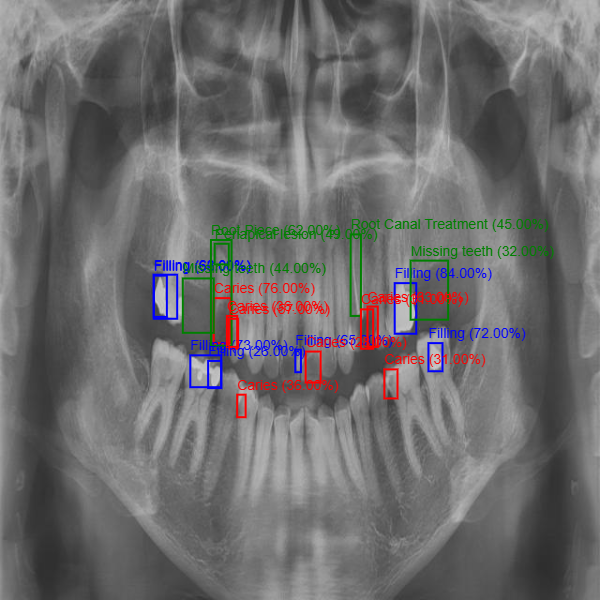

Dental-X is a web-based platform that allows dentists to upload dental
X-rays. The system processes the images using a trained deep learning
model and returns annotated results showing detected problem zones.

**Main Features:**\
1. Upload dental X-ray images via the web interface\
2. Process images using an AI model (CNN-based)\
3. Detect and highlight potential problem zones (e.g., cavities,
infections, fractures)\
4. Display the annotated result to the user

------------------------------------------------------------------------

## 3. Inputs and Outputs (I/O)

  ------------------------------------------------------------------------
  **Input**           **Description**               **Example**
  ------------------- ----------------------------- ----------------------
  X-ray image         A dental radiograph uploaded 
                       by the user    
                

                                    

  ------------------------------------------------------------------------

  -----------------------------------------------------------------------
  **Output**           **Description**              **Example**
  -------------------- ---------------------------- ---------------------
  Annotated X-ray      Image with problem zones     Red circles around
                       highlighted                  cavities

  Report               Text summary of findings     "Cavity detected on
                                                    molar region"
                                                     

  -----------------------------------------------------------------------
 
------------------------------------------------------------------------

## 4. Challenges Faced

1.  **Framework mismatch:** The original project used **Detectron2**,
    which requires **COCO-format annotations**, while my dataset was not
    in that format. Finding COCO-format dental datasets was very
    difficult.\
2.  **Dataset preparation:** I attempted to create a custom dataset in
    COCO format, but it was time-consuming and error-prone.\
3.  **Class inconsistency:** The original project supported **4
    classes**, but my dataset had **9 classes**, causing conflicts
    during training.\
4.  **Model incompatibility:** The main project used **YOLO**, which
    requires `.pt` weights, while Detectron2 produces `.pth` weights ---
    making direct integration impossible.

------------------------------------------------------------------------

## 5. Solutions / What I Did

1.  Retrained a new model using **YOLO** for better compatibility with
    the main project.\
2.  Updated the project pipeline to **output one image per detected
    class**, improving result visualization.\
3.  Implemented **error handling** to manage issues such as dataset
    format errors or failed training runs.\
4.  Modified the main project to be **flexible with the number of
    classes**, allowing adaptation to different datasets.

------------------------------------------------------------------------

## 6. Conclusion

**Results Achieved:**\
1. Successfully trained a YOLO-based model for dental X-ray analysis.\
2. Adapted the main project to handle **9 classes** instead of 4.\
3. Improved usability by generating **per-class output images** and
adding **error management**.

**What I Learned:**\
1. The importance of dataset format compatibility (**COCO vs YOLO**).\
2. The challenges of transferring models between frameworks
(**Detectron2 vs YOLO**).\
3. Practical aspects of dataset preparation and annotation.

**Future Improvements:**\
1. Automate dataset conversion between formats (**COCO ↔ YOLO**).\
2. Expand the dataset with more annotated X-rays to improve accuracy.\
3. Add support for exporting diagnostic reports in **PDF/JSON** format.
