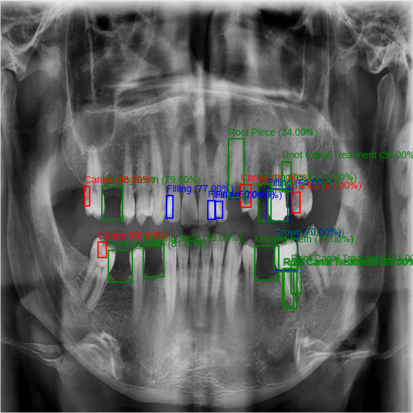

# Dental-X
A computer vision project for AI teeth xray analysis. This repo features a yolov8 object detection model based on the [dentex dataset](https://drive.google.com/drive/folders/15UN6PO--e1sH7CrsCCCnOPV8DcuXzGjc) and a simple web interface for querying it. 



## Content
1. Self hosting
2. Training
3. Evaluation

## Self Hosting
If you dont want to use the demo deployment and deploy the webUI yourself you have 2 options. You can either download the pretrained yolov8 model that i trained or you can train it yourself.
Download link: [dental model](https://github.com/ELHAMRYMohamed/Dental-X/blob/main/Dental-X/model.pt)
 After downloading it/training it just pop it into the root of this repo and name it "model.pt". After that run 
```
python3 -m pip install -r requirements.txt
```
followed by
```
python3 object_detector.py
```
This should make the UI available on http://127.0.0.1:8080
## Training Process
1. Use my dataset
Download link: [dental dataset](https://drive.google.com/drive/folders/15UN6PO--e1sH7CrsCCCnOPV8DcuXzGjc)

2. Build your own dataset (recommended if you want to adapt the model to a different domain).


## Evaluation
For the hyperparameters that i suggested my metrics are 
```
Ultralytics YOLOv8.0.227 🚀 Python-3.10.12 torch-2.1.0+cu121 CUDA:0 (Tesla T4, 15102MiB)
                  Class     Images  Instances      Box(P          R      mAP50  mAP50-95)     Mask(P         R      mAP50  mAP50-95): 100% ━━━━━━━━━━━━ 17/17 2.5it/s 6.9s
                   all        260       2535      0.644      0.604      0.604      0.348      0.623      0.562      0.557      0.273
                Caries         64        220      0.578      0.241      0.302       0.12      0.574      0.208      0.254     0.0885
                 Crown         88        224      0.751      0.847      0.787      0.576      0.759       0.83      0.788      0.475
               Filling        180        805       0.65      0.667      0.686      0.395      0.648      0.622      0.639      0.288
               Implant         10         27      0.847      0.963      0.951      0.569      0.864      0.963      0.983      0.438
      Mandibular Canal         13         25      0.489       0.44      0.461      0.256      0.377       0.32      0.296     0.0736
         Missing teeth         40         86      0.705      0.535      0.572      0.269      0.719      0.535      0.573      0.277
     Periapical lesion         54        139      0.388        0.1      0.123     0.0408      0.297     0.0647     0.0747     0.0192
  Root Canal Treatment        105        399       0.66      0.608      0.597       0.23      0.529      0.434       0.42      0.137
            Root Piece         22         68      0.643      0.721      0.726      0.343       0.67      0.676      0.662      0.271
        impacted tooth        212        524      0.865      0.916      0.928      0.644      0.878      0.916      0.928      0.597
       maxillary sinus          9         18      0.514      0.611      0.513      0.389      0.534      0.611      0.513      0.339
```
